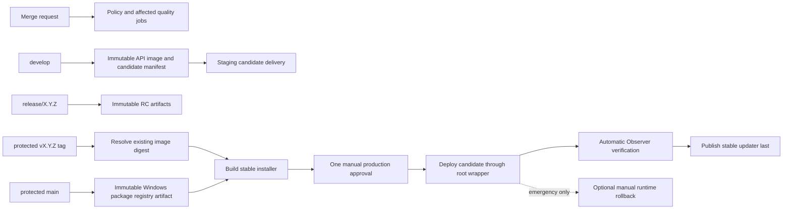

# Текущий pipeline график

Метки: **факт**, **вывод**, **предположение**, **неизвестно**, **предложение**.

- **факт:** конвейеры merge-request не содержат развертывания SSH, публикации updater или секретов production.
- **факт:** `develop` создает неизменяемый образ API и формирует редактированный манифест кандидата. Задание доставки staging присутствует, но не может выполняться, пока не будет существовать изолированный хост staging и его переменные.
- **факт:** защищённый тег SemVer разрешает уже собранный образ API по дайджесту и уже собранный пакет Windows по коммиту SHA; он не перестраивает ни один из артефактов.
- **факт:** `windows-production-package` предшествует `deploy-production-runtime`; `publish-production` ожидает runtime и проверки Наблюдателем, затем передает `latest.yml` обертке updater, принадлежащей root, как финальный шаг стабильного раскрытия.
- **факт (25-07-2026):** `deploy-production-runtime` является единственной обязательной ручной работой в пути тега production. Агент наблюдаемости с контрольной суммой production запускается автоматически после этого runtime, за которым следует проверка Observer телеметрии нового хоста Alloy. `rollback-production-runtime` является отдельным необязательным аварийным действием и может быть пропущен.
- **вывод:** такое упорядочивание предотвращает отображение стабильного обновления клиента до того, как runtime и контрольные точки мониторинга будут выполнены успешно.
- **неизвестно:** staging идентичность хоста, приватный маршрут и бета-updater конечная точка.
- **предложение:** После production миграции и staging имиджа сделать staging доставку кандидатов автоматической и публикацию бета-гейта на staging smoke plus верификацию Observer.
