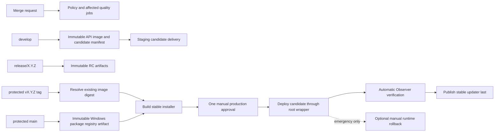

# Current pipeline graph

Labels: **fact**, **inference**, **assumption**, **unknown**, **proposal**.

- **fact:** merge-request pipelines contain no SSH deployment, updater publication, or production secrets.
- **fact:** `develop` builds an immutable API image and creates a redacted candidate manifest. The staging delivery job is present but cannot run until the isolated staging host and its variables exist.
- **fact:** a protected SemVer tag resolves the already-built API image by digest and the already-built Windows package by commit SHA; it rebuilds neither artifact.
- **fact:** `windows-production-package` precedes `deploy-production-runtime`; `publish-production` waits for runtime and Observer verification, then gives `latest.yml` to the root-owned updater wrapper as the final stable exposure step.
- **fact (2026-07-25):** `deploy-production-runtime` is the only mandatory manual job in the production tag path. The checksum-bound production observability agent starts automatically after that runtime, followed by Observer verification of the new host's Alloy telemetry. `rollback-production-runtime` is a separate optional emergency action and is allowed to be skipped.
- **inference:** this ordering prevents a stable client update from becoming visible before runtime and monitoring gates have succeeded.
- **unknown:** staging host identity, private route and beta updater endpoint.
- **proposal:** after production migration and staging reimage, make staging candidate delivery automatic and gate beta publication on staging smoke plus Observer verification.
